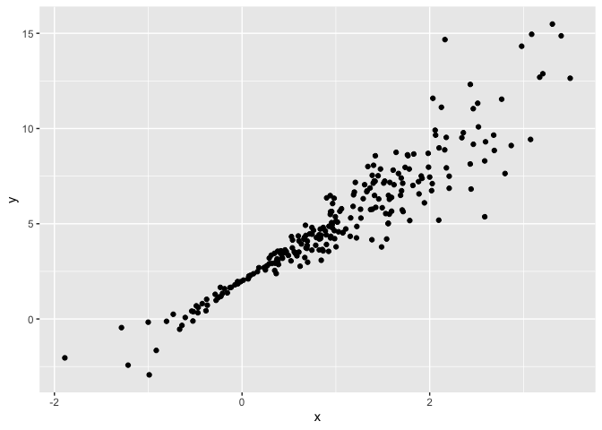
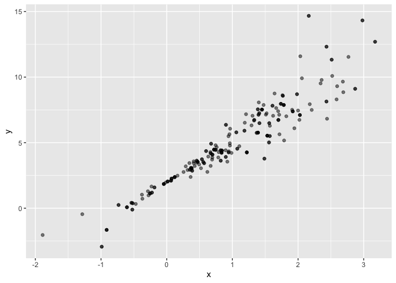
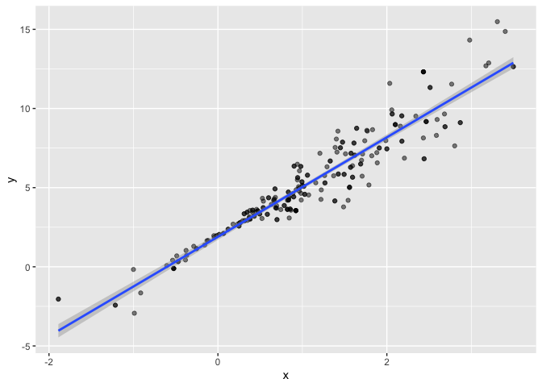
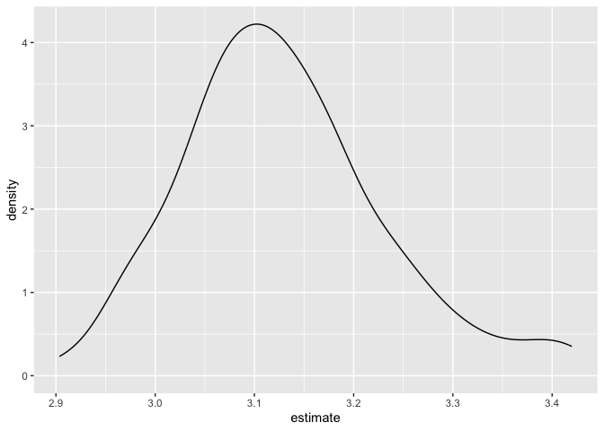
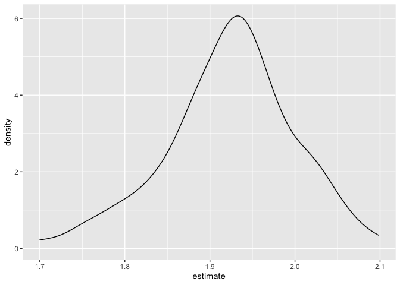
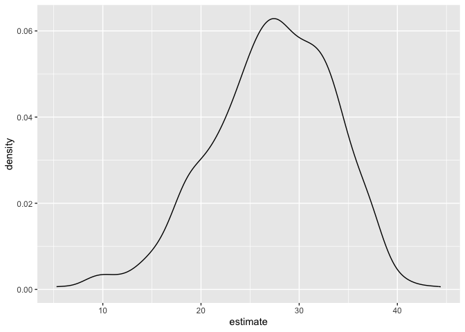

Bootstrapping
================
Courtney Diamond
2023-11-27

## Load key packages

``` r
library(tidyverse)
```

    ## ── Attaching core tidyverse packages ──────────────────────── tidyverse 2.0.0 ──
    ## ✔ dplyr     1.1.3     ✔ readr     2.1.4
    ## ✔ forcats   1.0.0     ✔ stringr   1.5.0
    ## ✔ ggplot2   3.4.3     ✔ tibble    3.2.1
    ## ✔ lubridate 1.9.2     ✔ tidyr     1.3.0
    ## ✔ purrr     1.0.2     
    ## ── Conflicts ────────────────────────────────────────── tidyverse_conflicts() ──
    ## ✖ dplyr::filter() masks stats::filter()
    ## ✖ dplyr::lag()    masks stats::lag()
    ## ℹ Use the conflicted package (<http://conflicted.r-lib.org/>) to force all conflicts to become errors

``` r
library(p8105.datasets)
library(modelr)

set.seed(1)
```

## Generate a relevant example

``` r
n_samp= 250

sim_df_const = 
  tibble(
    x = rnorm(n_samp, 1, 1),
    error = rnorm(n_samp, 0, 1),
    y = 2 + 3 * x + error
  )

sim_df_nonconst = 
  sim_df_const |> 
  mutate(
    error = error * 0.75 * x,
    y = 2 + 3 * x + error
  )

sim_df_const |> 
  ggplot(aes(x = x, y = y)) + 
  geom_point()
```

<!-- -->

``` r
sim_df_nonconst |> 
  ggplot(aes(x = x, y = y)) + 
  geom_point()
```

<!-- -->

Fit some linear models

``` r
sim_df_const |> 
  lm(y ~ x, data = _) |> 
  broom::tidy()
```

    ## # A tibble: 2 × 5
    ##   term        estimate std.error statistic   p.value
    ##   <chr>          <dbl>     <dbl>     <dbl>     <dbl>
    ## 1 (Intercept)     1.98    0.0981      20.2 3.65e- 54
    ## 2 x               3.04    0.0699      43.5 3.84e-118

``` r
sim_df_nonconst |> 
  lm(y ~ x, data = _) |> 
  broom::tidy()
```

    ## # A tibble: 2 × 5
    ##   term        estimate std.error statistic   p.value
    ##   <chr>          <dbl>     <dbl>     <dbl>     <dbl>
    ## 1 (Intercept)     1.93    0.105       18.5 1.88e- 48
    ## 2 x               3.11    0.0747      41.7 5.76e-114

## Draw a bootstrap sample

``` r
boot_sample = function(df) {
  
  sample_frac(df, replace = TRUE)
  
}
```

Let’s see how this works

``` r
sim_df_nonconst |> 
  boot_sample() |> 
  ggplot(aes(x = x, y = y)) +
  geom_point(alpha = 0.5)
```

<!-- --> The
darker points indicate which samples have been selected multiple times
from the original sample

``` r
sim_df_nonconst |> 
  boot_sample() |> 
  ggplot(aes(x = x, y = y)) +
  geom_point(alpha = 0.5) + 
  stat_smooth(method = "lm")
```

    ## `geom_smooth()` using formula = 'y ~ x'

<!-- -->

## Draw a lot of samples and analyze them

``` r
boot_straps = 
  tibble(strap_number = 1:100) |> 
  mutate(
    strap_sample = map(strap_number, \(i) boot_sample(sim_df_nonconst))
  )

boot_straps |> 
  pull(strap_sample) |> 
  nth(2) |> 
  arrange(x)
```

    ## # A tibble: 250 × 3
    ##         x  error      y
    ##     <dbl>  <dbl>  <dbl>
    ##  1 -1.89   1.62  -2.04 
    ##  2 -1.89   1.62  -2.04 
    ##  3 -1.29   1.40  -0.454
    ##  4 -1.29   1.40  -0.454
    ##  5 -1.00   0.832 -0.169
    ##  6 -0.914 -0.908 -1.65 
    ##  7 -0.805  0.292 -0.123
    ##  8 -0.665 -0.544 -0.539
    ##  9 -0.665 -0.544 -0.539
    ## 10 -0.665 -0.544 -0.539
    ## # ℹ 240 more rows

Now do the ‘lm’ fit.

``` r
boot_results = 
  boot_straps |> 
  mutate(
    models = map(strap_sample, \(df) lm(y ~ x, data = df)),
    results = map(models, broom::tidy)
  ) |> 
  select(strap_number, results) |> 
  unnest(results)

boot_results
```

    ## # A tibble: 200 × 6
    ##    strap_number term        estimate std.error statistic   p.value
    ##           <int> <chr>          <dbl>     <dbl>     <dbl>     <dbl>
    ##  1            1 (Intercept)     1.89    0.118       16.0 4.78e- 40
    ##  2            1 x               3.12    0.0843      37.0 5.32e-103
    ##  3            2 (Intercept)     2.06    0.0976      21.1 3.71e- 57
    ##  4            2 x               2.97    0.0690      43.1 2.89e-117
    ##  5            3 (Intercept)     2.04    0.102       20.0 9.03e- 54
    ##  6            3 x               3.03    0.0699      43.3 1.43e-117
    ##  7            4 (Intercept)     1.90    0.113       16.8 1.01e- 42
    ##  8            4 x               3.18    0.0772      41.2 7.18e-113
    ##  9            5 (Intercept)     1.95    0.112       17.3 1.22e- 44
    ## 10            5 x               2.97    0.0787      37.8 6.61e-105
    ## # ℹ 190 more rows

Try to summarize these results – get a bootstrap SE.

``` r
boot_results |> 
  group_by(term) |> 
  summarize(
    se = sd(estimate)
  )
```

    ## # A tibble: 2 × 2
    ##   term            se
    ##   <chr>        <dbl>
    ## 1 (Intercept) 0.0754
    ## 2 x           0.102

Look at the distribution

``` r
boot_results |> 
  filter(term == "x") |> 
  ggplot(aes(x = estimate)) +
  geom_density()
```

<!-- -->

``` r
boot_results |> 
  filter(term == "(Intercept)") |> 
  ggplot(aes(x = estimate)) +
  geom_density()
```

<!-- -->

Can I construct a CI

``` r
boot_results |> 
  group_by(term) |> 
  summarize(
    ci_lower = quantile(estimate, 0.025),
    ci_upper = quantile(estimate, 0.975)
  )
```

    ## # A tibble: 2 × 3
    ##   term        ci_lower ci_upper
    ##   <chr>          <dbl>    <dbl>
    ## 1 (Intercept)     1.76     2.06
    ## 2 x               2.97     3.38

If we repeat for our CONSTANT model (where assumptions are met)- our SEs
should be roughly equivalent !

``` r
boot_straps_const = 
  tibble(strap_number = 1:100) |> 
  mutate(
    strap_sample = map(strap_number, \(i) boot_sample(sim_df_const))
  )

boot_straps_const |> 
  pull(strap_sample) |> 
  nth(2) |> 
  arrange(x)
```

    ## # A tibble: 250 × 3
    ##         x   error      y
    ##     <dbl>   <dbl>  <dbl>
    ##  1 -1.29  -1.45   -3.31 
    ##  2 -1.21   0.857  -0.787
    ##  3 -1.21   0.857  -0.787
    ##  4 -1.21   0.857  -0.787
    ##  5 -0.914  1.32    0.581
    ##  6 -0.733 -0.813  -1.01 
    ##  7 -0.536 -0.0565  0.334
    ##  8 -0.524  1.36    1.79 
    ##  9 -0.518  0.164   0.609
    ## 10 -0.518  0.164   0.609
    ## # ℹ 240 more rows

``` r
boot_results_const = 
  boot_straps_const |> 
  mutate(
    models = map(strap_sample, \(df) lm(y ~ x, data = df)),
    results = map(models, broom::tidy)
  ) |> 
  select(strap_number, results) |> 
  unnest(results)

boot_results_const
```

    ## # A tibble: 200 × 6
    ##    strap_number term        estimate std.error statistic   p.value
    ##           <int> <chr>          <dbl>     <dbl>     <dbl>     <dbl>
    ##  1            1 (Intercept)     1.95    0.0982      19.8 5.28e- 53
    ##  2            1 x               3.01    0.0719      41.9 1.40e-114
    ##  3            2 (Intercept)     2.16    0.0923      23.4 1.11e- 64
    ##  4            2 x               3.03    0.0651      46.5 1.61e-124
    ##  5            3 (Intercept)     1.88    0.0959      19.6 2.01e- 52
    ##  6            3 x               3.07    0.0733      41.9 1.36e-114
    ##  7            4 (Intercept)     1.90    0.105       18.0 5.87e- 47
    ##  8            4 x               3.04    0.0770      39.4 8.91e-109
    ##  9            5 (Intercept)     2.26    0.0931      24.3 1.26e- 67
    ## 10            5 x               2.91    0.0657      44.4 6.46e-120
    ## # ℹ 190 more rows

``` r
boot_results_const |> 
  group_by(term) |> 
  summarize(
    se = sd(estimate)
  )
```

    ## # A tibble: 2 × 2
    ##   term            se
    ##   <chr>        <dbl>
    ## 1 (Intercept) 0.104 
    ## 2 x           0.0694

Yay they compare.

## Airbnb

``` r
data("nyc_airbnb")

nyc_airbnb = 
  nyc_airbnb |> 
  mutate(stars = review_scores_location / 2) |> 
  rename(
    borough = neighbourhood_group
  ) |> 
  filter(borough != "Staten Island") |> 
  drop_na(price, stars) |> 
  select(price, stars, room_type, borough)
```

Let’s fit a regression of `price` on other variables and look at
residuals.

``` r
airbnb_fit =
  nyc_airbnb |> 
  lm(price ~ stars + room_type + borough, data = _)
```

Residuals!!

``` r
nyc_airbnb |> 
  modelr::add_residuals(airbnb_fit) |> 
  ggplot(aes(x = stars, y = resid)) +
  geom_point()
```

<!-- -->

Run a bootstrap to get estimates for the effect of `stars` on `price`.

``` r
manhattan_df = 
  nyc_airbnb |> 
  filter(borough == "Manhattan")

boot_results_airbnb = 
  tibble(strap_number = 1:1000) |> 
  mutate(
    strap_sample = map(strap_number, \(i) boot_sample(manhattan_df)),
    models = map(strap_sample, \(df) lm(price ~ stars + room_type, data = df)),
    results = map(models, broom::tidy)
         ) |> 
  select(strap_number, results) |> 
  unnest(results)

boot_results_airbnb |> 
  filter(term == "stars") |> 
  ggplot(aes(x = estimate)) +
  geom_density()
```

<!-- -->
