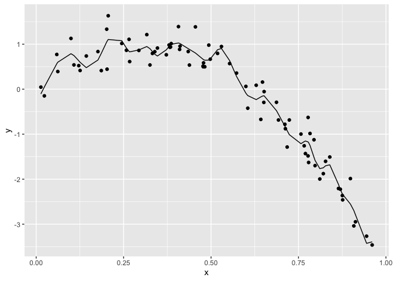
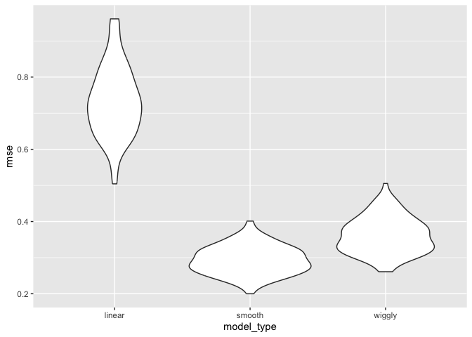

Cross Validation
================
Courtney Diamond
2023-11-27

## Load key packages

``` r
library(tidyverse)
```

    ## ── Attaching core tidyverse packages ──────────────────────── tidyverse 2.0.0 ──
    ## ✔ dplyr     1.1.3     ✔ readr     2.1.4
    ## ✔ forcats   1.0.0     ✔ stringr   1.5.0
    ## ✔ ggplot2   3.4.3     ✔ tibble    3.2.1
    ## ✔ lubridate 1.9.2     ✔ tidyr     1.3.0
    ## ✔ purrr     1.0.2     
    ## ── Conflicts ────────────────────────────────────────── tidyverse_conflicts() ──
    ## ✖ dplyr::filter() masks stats::filter()
    ## ✖ dplyr::lag()    masks stats::lag()
    ## ℹ Use the conflicted package (<http://conflicted.r-lib.org/>) to force all conflicts to become errors

``` r
library(modelr)

set.seed(1)
```

## Nonlinear data and CV

``` r
nonlin_df = 
  tibble(
    id = 1:100,
    x = runif(100, 0, 1),
    y = 1 - 10 * (x - 0.3) ^ 2 + rnorm(100, 0, 0.3)
  )

nonlin_df |> 
  ggplot(aes(x = x, y = y)) +
  geom_point()
```

<!-- -->

Do the train/test split. (First by Hand)

``` r
train_df = sample_n(nonlin_df, 80)

test_df = anti_join(nonlin_df, train_df, by = "id")

train_df |> 
  ggplot(aes(x = x, y = y)) +
  geom_point() +
  geom_point(data = test_df, color = "red")
```

<!-- -->

``` r
linear_mod = lm(y ~ x, data = train_df)
```

Quick visualization of the linear model

``` r
train_df |> 
  modelr::add_predictions(linear_mod) |> 
  ggplot(aes(x = x, y = y)) +
  geom_point() +
  geom_line(aes(y = pred))
```

<!-- -->

It’s not great! Let’s try to do a better one.

``` r
smooth_mod = mgcv::gam(y ~ s(x), data = train_df)
```

``` r
train_df |> 
  modelr::add_predictions(smooth_mod) |> 
  ggplot(aes(x = x, y = y)) +
  geom_point() +
  geom_line(aes(y = pred))
```

<!-- -->

Much better. But let’s mess around a little bit.

``` r
wiggly_mod = mgcv::gam(y ~ s(x, k = 30), sp = 10e-6, data = train_df)
train_df |> 
  modelr::add_predictions(wiggly_mod) |> 
  ggplot(aes(x = x, y = y)) +
  geom_point() +
  geom_line(aes(y = pred))
```

<!-- -->

IT WIGGLY

AIC and BIC and F-test don’t work here- model isn’t nested, isn’t clear
how many degrees of freedom there are. So instead, we’ll use the RMSE
method.

``` r
rmse(linear_mod, train_df)
```

    ## [1] 0.7178747

``` r
rmse(smooth_mod, train_df)
```

    ## [1] 0.2874834

``` r
rmse(wiggly_mod, train_df)
```

    ## [1] 0.2498309

So far looks like the linear one is best, but we don’t know for sure!
Need to check it out on the testing data for out-of-sample prediction
accuracy.

``` r
rmse(linear_mod, test_df)
```

    ## [1] 0.7052956

``` r
rmse(smooth_mod, test_df)
```

    ## [1] 0.2221774

``` r
rmse(wiggly_mod, test_df)
```

    ## [1] 0.289051

Good thing we tested- our best model switched from being wiggly to
smooth.

## Now let’s use modelr for CV

``` r
cv_df = 
  nonlin_df |> 
  crossv_mc(n = 100)

cv_df
```

    ## # A tibble: 100 × 3
    ##    train               test                .id  
    ##    <list>              <list>              <chr>
    ##  1 <resample [79 x 3]> <resample [21 x 3]> 001  
    ##  2 <resample [79 x 3]> <resample [21 x 3]> 002  
    ##  3 <resample [79 x 3]> <resample [21 x 3]> 003  
    ##  4 <resample [79 x 3]> <resample [21 x 3]> 004  
    ##  5 <resample [79 x 3]> <resample [21 x 3]> 005  
    ##  6 <resample [79 x 3]> <resample [21 x 3]> 006  
    ##  7 <resample [79 x 3]> <resample [21 x 3]> 007  
    ##  8 <resample [79 x 3]> <resample [21 x 3]> 008  
    ##  9 <resample [79 x 3]> <resample [21 x 3]> 009  
    ## 10 <resample [79 x 3]> <resample [21 x 3]> 010  
    ## # ℹ 90 more rows

This made 100 different trainina and test splits! But it’s not a true
tibble.

``` r
cv_df |> 
  pull(train) |> 
  nth(1) |> 
  as_tibble()
```

    ## # A tibble: 79 × 3
    ##       id      x       y
    ##    <int>  <dbl>   <dbl>
    ##  1     1 0.266   1.11  
    ##  2     2 0.372   0.764 
    ##  3     3 0.573   0.358 
    ##  4     4 0.908  -3.04  
    ##  5     6 0.898  -1.99  
    ##  6     7 0.945  -3.27  
    ##  7     8 0.661  -0.615 
    ##  8     9 0.629   0.0878
    ##  9    10 0.0618  0.392 
    ## 10    11 0.206   1.63  
    ## # ℹ 69 more rows

``` r
cv_df = 
  nonlin_df |> 
  crossv_mc(n = 100) |> 
  mutate(train = map(train, as_tibble),
         test = map(test, as_tibble))

cv_df
```

    ## # A tibble: 100 × 3
    ##    train             test              .id  
    ##    <list>            <list>            <chr>
    ##  1 <tibble [79 × 3]> <tibble [21 × 3]> 001  
    ##  2 <tibble [79 × 3]> <tibble [21 × 3]> 002  
    ##  3 <tibble [79 × 3]> <tibble [21 × 3]> 003  
    ##  4 <tibble [79 × 3]> <tibble [21 × 3]> 004  
    ##  5 <tibble [79 × 3]> <tibble [21 × 3]> 005  
    ##  6 <tibble [79 × 3]> <tibble [21 × 3]> 006  
    ##  7 <tibble [79 × 3]> <tibble [21 × 3]> 007  
    ##  8 <tibble [79 × 3]> <tibble [21 × 3]> 008  
    ##  9 <tibble [79 × 3]> <tibble [21 × 3]> 009  
    ## 10 <tibble [79 × 3]> <tibble [21 × 3]> 010  
    ## # ℹ 90 more rows

Apply each model to all training datasets, and evaluate on all testing
datasets. We’re going to use an anon function again!

``` r
cv_results = 
  cv_df |> 
  mutate(
    linear_fit = map(train, \(df) lm(y ~ x,data = df)),
    smooth_fit = map(train, \(df) mgcv::gam(y ~ s(x),data = df)),
    wiggly_fit = map(train, \(df) mgcv::gam(y ~ s(x, k = 30), sp = 10e-6,data = df))
  ) |> 
  mutate(
    rmse_linear = map2_dbl(linear_fit, test, \(mod, df) rmse(mod, df)),
    rmse_smooth = map2_dbl(smooth_fit, test, \(mod, df) rmse(mod, df)),
    rmse_wiggly = map2_dbl(wiggly_fit, test, \(mod, df) rmse(mod, df))
  )

cv_results
```

    ## # A tibble: 100 × 9
    ##    train             test     .id   linear_fit smooth_fit wiggly_fit rmse_linear
    ##    <list>            <list>   <chr> <list>     <list>     <list>           <dbl>
    ##  1 <tibble [79 × 3]> <tibble> 001   <lm>       <gam>      <gam>            0.747
    ##  2 <tibble [79 × 3]> <tibble> 002   <lm>       <gam>      <gam>            0.602
    ##  3 <tibble [79 × 3]> <tibble> 003   <lm>       <gam>      <gam>            0.955
    ##  4 <tibble [79 × 3]> <tibble> 004   <lm>       <gam>      <gam>            0.691
    ##  5 <tibble [79 × 3]> <tibble> 005   <lm>       <gam>      <gam>            0.712
    ##  6 <tibble [79 × 3]> <tibble> 006   <lm>       <gam>      <gam>            0.610
    ##  7 <tibble [79 × 3]> <tibble> 007   <lm>       <gam>      <gam>            0.758
    ##  8 <tibble [79 × 3]> <tibble> 008   <lm>       <gam>      <gam>            0.803
    ##  9 <tibble [79 × 3]> <tibble> 009   <lm>       <gam>      <gam>            0.705
    ## 10 <tibble [79 × 3]> <tibble> 010   <lm>       <gam>      <gam>            0.959
    ## # ℹ 90 more rows
    ## # ℹ 2 more variables: rmse_smooth <dbl>, rmse_wiggly <dbl>

``` r
cv_results |> 
  select(starts_with("rmse")) |> 
  pivot_longer(
    everything(),
    names_to = "model_type",
    values_to = "rmse",
    names_prefix = "rmse_"
  ) |> 
  group_by(model_type) |> 
  summarize(m_rmse = mean(rmse))
```

    ## # A tibble: 3 × 2
    ##   model_type m_rmse
    ##   <chr>       <dbl>
    ## 1 linear      0.733
    ## 2 smooth      0.293
    ## 3 wiggly      0.362

Smooth has the lowest RMSE!

``` r
cv_results |> 
  select(starts_with("rmse")) |> 
  pivot_longer(
    everything(),
    names_to = "model_type",
    values_to = "rmse",
    names_prefix = "rmse_"
  ) |> 
  ggplot(aes(x = model_type, y = rmse)) +
  geom_violin()
```

<!-- -->
